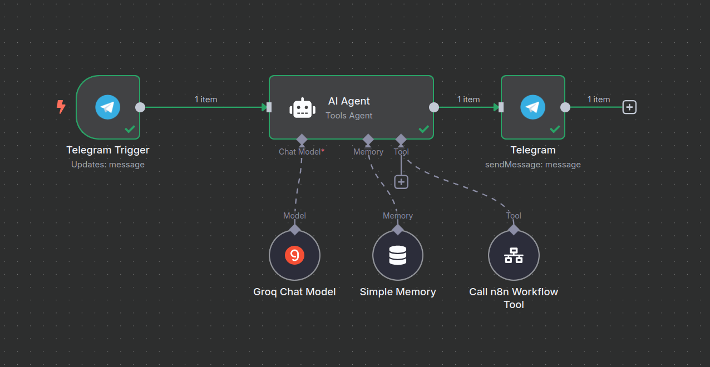
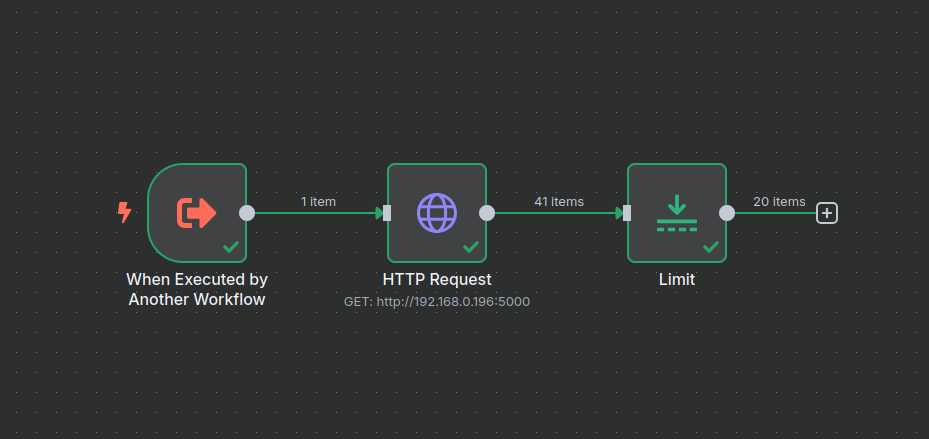

# 🛠️ Telegram Job Scraper Bot with n8n & Selenium

This project implements a fully automated job scraper and notifier system. It uses a Python script with Selenium to scrape job postings from [pracuj.pl](https://pracuj.pl), and a Telegram bot built using [n8n](https://n8n.io) to interact with users and deliver job results on request.

---

## 📦 Features

- Scrapes latest Python-related job offers from pracuj.pl
- Filters out saved/starred job offers
- Returns structured data including title, company, location, technologies, and link
- User can ask for job offers via Telegram and receive them instantly
- Automation powered by n8n workflows
- Supports memory and custom tools integration in AI Agent node

---

## 🔧 Technologies Used

- Python
  - `selenium`
  - `beautifulsoup4`
  - `python-dotenv`
- Chrome WebDriver
- Telegram Bot API
- n8n (Low-code automation platform)
- Groq Chat Model (via AI Agent in n8n)
- Simple Memory and Workflow Tools (n8n integrations)

---

## 🧠 Project Architecture

### 1. Python Web Scraper

- Authenticates into pracuj.pl with credentials from `.env`
- Navigates to the job search page
- Scrapes job offer data
- Saves filtered results into `job_offers.json`

### 2. n8n Workflows

- **Workflow 1**: 
  - Triggered on Telegram message
  - Uses AI Agent (Groq Model + Memory + Tool)
  - Tool: Calls another n8n workflow to fetch job data
  - Responds via Telegram

- **Workflow 2**: 
  - Triggered by another workflow
  - Makes HTTP request to Python job scraper API (hosted locally)
  - Limits results and returns top 20 offers

---

## ▶️ How to Run

### 1. Setup Python Environment

```bash
pip install -r requirements.txt
```

`.env` file format:

```
EMAIL=your_email_here
PASSWORD=your_password_here
```

### 2. Run the Scraper Locally

```bash
python job_scraper.py
```

The scraper runs on a local server (e.g., Flask or any HTTP server exposing it via `http://localhost:5000`).

### 3. Setup and Deploy n8n

- Create Telegram bot and connect it to n8n
- Import the workflow files on your own n8n dashbord and config them


---

## 📷 Screenshots

Here are some visuals of the workflows in action:

### 🧩 n8n Workflow 1 - Telegram Trigger


### 🔄 n8n Workflow 2 - Job Fetcher



---

## 🧪 Future Improvements

- Host scraper behind a Flask API permanently
- Enable auto-triggered updates every X hours
- Improve error handling and retries in scraper

---

## 📄 License

MIT License